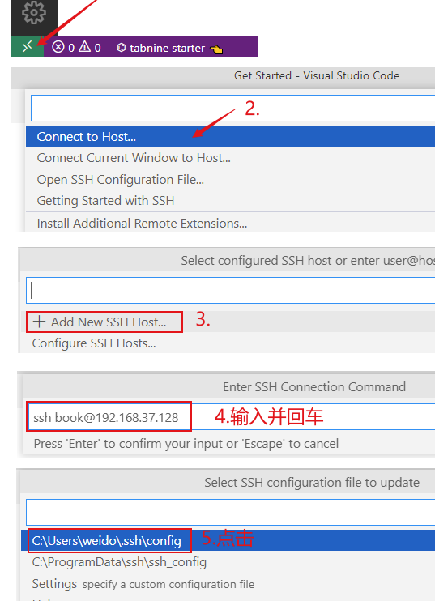
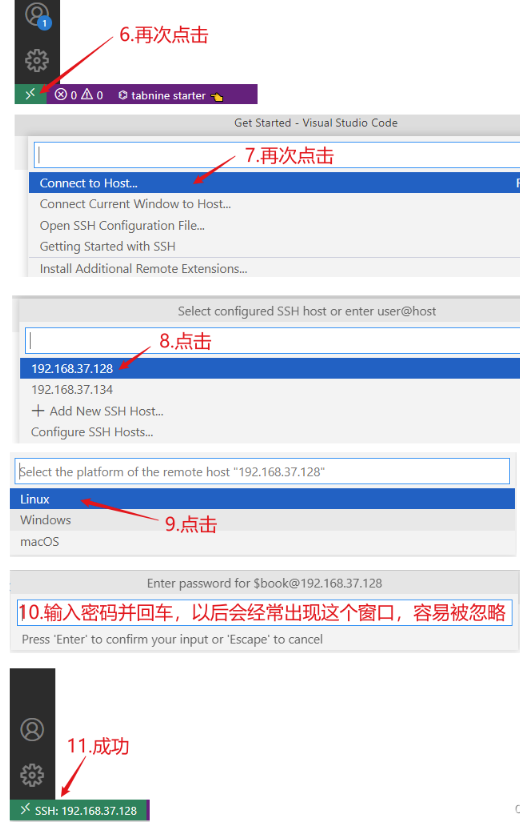
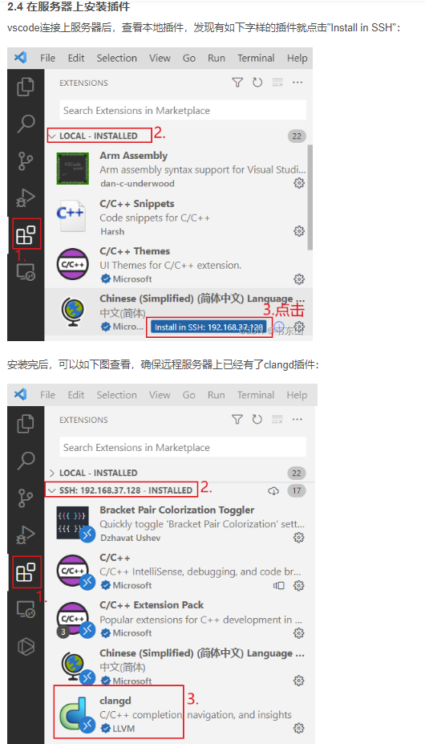

# kerneldocker

## 简介

一个用于linux kernel 编译、源码查看、调试的docker。

含有qemu、kernel5-6的编译环境、gdb

一切从简，里面只有原生gdb，没有安装插件，gdb调试内核感觉没啥好用的插件

```
docker build -t chenaotian/kerneldocker .
docker run -it -d -h breeze --name kd -p 22222:22 -v D:\share:/ctf/work  --cap-add=SYS_PTRACE --cap-add=SYS_PTRACE chenaotian/kerneldocker:latest /bin/bash
```


## 配置vscode通过该docker看内核代码

下文操作全部参考：https://blog.csdn.net/thisway_diy/article/details/127556249

先安装如下vscode 插件：

```
C/C++
C/C++ Extension Pack
C/C++ Snippets
Clangd
Remote SSH
Code Runner
Code Spell Checker
vscode-icons
compareit
DeviceTree
Tabnine AI Autocomplete
Bracket Pair Colorization Toggler
Rainbow Highlighter
    高亮文字：shift + alt + z
    取消高亮：shift + alt + a
Arm Assembly
x86 and x86_64 Assembly #我们看x86的代码则安装这个
Chinese
Hex Editor
One Dark Pro
Markdown All in One
Markdown Preview Enhanced
```

ps：该博客中说vscode自带的ssh有bug，但我写文章的时候测试使用正常，所以不用关心。如果第二次启动docker 连接不上了，可以到`C:\Users\username\.ssh`目录删掉known_hosts历史缓存文件。

启动docker，docker 默认开启ssh，启动的时候将22端口映射到主机：

```
docker run -it -d -h breeze --name kd -p 22222:22 -v D:\share:/ctf/work  --cap-add=SYS_PTRACE --cap-add=SYS_PTRACE chenaotian/kerneldocker:latest /bin/bash
```

然后将内核代码拷贝到docker 中或者在docker 中git。

然后用如下命令编译：

```
bear make -j4 bzImage
```

编译好在目录下会有compile_commands.json 文件，什么也不用改。

通过博客中的方法ssh上去:





然后再插件中将clangd 安装到目标主机，然后直接打开文件夹选择远程docker中的kernel代码文件夹即可。中途需要输入密码:



然后打开服务器中的目录就可以浏览代码了：

- 已经根据编译选项显示代码的实际生效部分
- 指针悬停提示详细内容
- alt + 左键跳转函数定义

```
输入文件名打开文件: Ctrl + P
跳到某行: Ctrl + G + 行号
打开文件并跳到某行: Ctrl + p 文件名:行号
列出文件里的函数 : Ctrl + Shift + O，可以输入函数名跳转
函数/变量跳转: 按住Ctrl同时使用鼠标左键点击、F12
前进: Ctrl + Shift + -
后退: Ctrl + Alt + -
列出引用 : Shift + F12
查找所有引用 : Alt + Shift + F12
切换侧边栏展示/隐藏: Ctrl + B
打开命令菜单: Ctrl + Shift + P
手动触发建议: Ctrl + Space
手动触发参数提示: Ctrl + Shift + Space
打开/隐藏终端: Ctrl + `(Tab上方的那个键)
重命名符号: F2
当前配置调试: F5
上/下滚编辑器: Ctrl + ↑/↓
搜索/替换 : Ctrl + F/H
高亮文字：shift + alt + z
取消高亮：shift + alt + a
```


